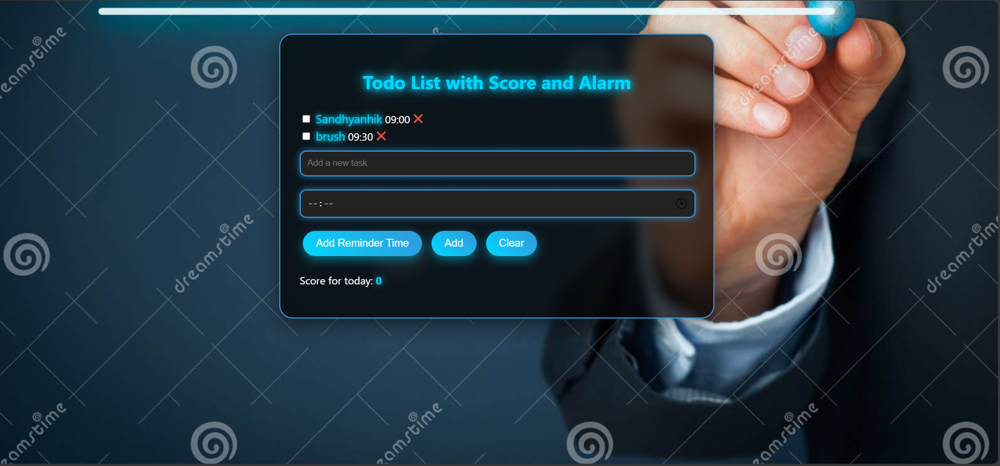

# Todo List with Score and Alarm

A modern, visually appealing, and functional **Todo List Application** designed to boost productivity. It features a scoring system, reminder alarms, and a sleek UI with advanced CSS effects, ensuring a smooth user experience. Perfect for task management with a bit of gamification.

---

## Features
- **Add Tasks**: Easily add tasks with reminders and completion times.
- **Scoring System**: Keep track of completed tasks with a score counter for daily achievements.
- **Reminder Alarms**: Get notified with alarms based on task reminders.
- **Modern Design**: A clean, frosted-glass effect, glowing input fields, and hover animations for a refined user interface.
- **Responsive Layout**: Optimized for all screen sizes to ensure a smooth experience on any device.

---

## Demo

To see the project in action, clone this repository and open the `index.html` file in your browser.

---

## Usage

1. **Clone the Repository**:
   ```bash
   git clone https://github.com/yourusername/todo-list-score-alarm.git
   open todo.html
2.**screenshots**:
```markdown
   

